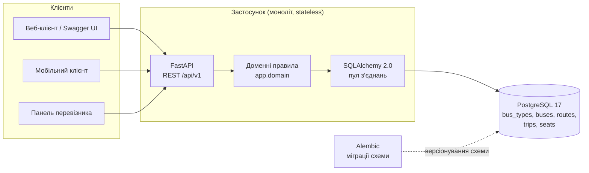
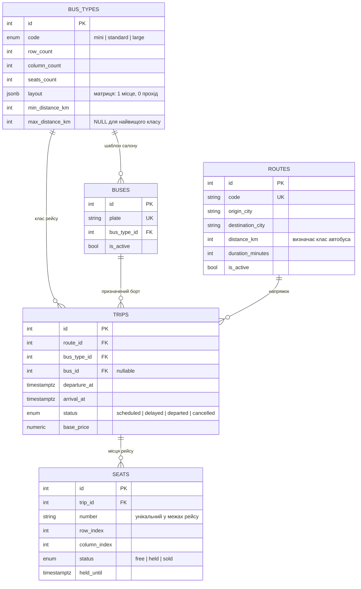
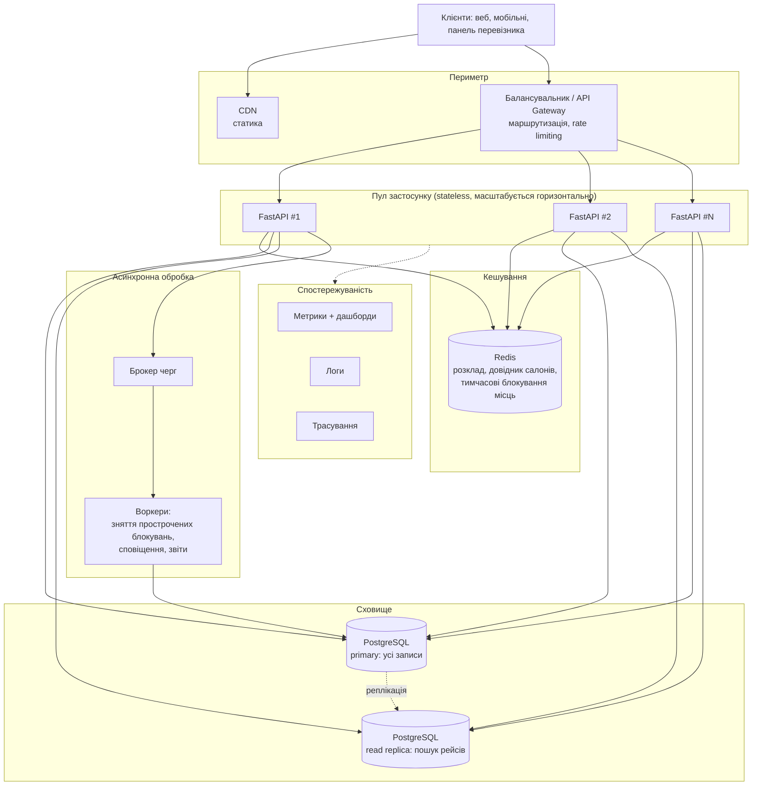

# Архітектура системи

## 1. Вихідні припущення

Архітектура спроєктована під параметри навантаження, характерні для продажу квитків
(за методикою теми 1: спочатку описуємо характер навантаження, лише потім обираємо
рішення).

| Операція | Частота | Характер | Критичний показник |
| --- | --- | --- | --- |
| Пошук рейсів | дуже висока | read, майже незмінні дані | час відгуку p95 |
| Перегляд схеми салону | висока | read, дані змінюються щосекунди | свіжість даних |
| Блокування місця (`hold`) | середня | write, конкурентний | коректність, відсутність подвійного продажу |
| Підтвердження оплати | середня | write, транзакційний | надійність |
| Зміна розкладу адміністратором | низька | write, інвалідує кеш | узгодженість |

Головний висновок: система **read-heavy**, але її коректність визначається вузьким
write-сценарієм. Тому кешувати можна агресивно, а запис — лише через базу з
транзакційними гарантіями.

## 2. Поточний стан (лабораторна №1)

На цьому етапі свідомо реалізований **моноліт** — за темою 1 це виправданий вибір для
проєкту на початковій стадії: проектування «на виріст» під гіпотетичне навантаження
шкодить, поки не перевірена бізнес-логіка.



Ключові рішення цього етапу:

- **Застосунок не тримає стану запиту в пам'яті процесу.** Жодних сесій у
  локальних словниках, жодного кешу в глобальних змінних. Це умова, без якої
  горизонтальне масштабування у наступних роботах вимагало б переписування коду
  (тема 1: stateless-сервіси масштабувати простіше за stateful).
- **Конфігурація лише з оточення** (`app/core/config.py`). Один і той самий код
  запускається локально, у контейнері й за балансувальником.
- **Два різні маршрути перевірки стану**: `/health` (liveness, не торкається бази) і
  `/health/db` (readiness, виконує `SELECT 1`). Саме їх опитуватиме балансувальник,
  щоб не надсилати трафік на екземпляр, який втратив зв'язок із базою.
- **Обмеження цілісності — у базі, а не тільки в коді.** Унікальність
  `(trip_id, number)`, зовнішні ключі з правилами каскаду, `CHECK`-обмеження.
- **PostgreSQL з першої роботи.** SQLite блокує базу цілком замість блокування
  рядка, тому на ньому неможливо коректно відтворити ключовий сценарій цієї
  предметної області.

## 3. Модель даних



Індекси та обмеження, закладені під сценарії навантаження:

| Об'єкт | Призначення |
| --- | --- |
| `uq_seats_trip_number` | гарантія проти подвійного продажу місця |
| `ix_seats_trip_status` | швидкий підрахунок вільних місць рейсу |
| `ix_trips_route_departure` | пошук рейсів за напрямком і датою |
| `ix_trips_departure_at` | вибірка розкладу на добу |
| `ix_routes_cities` | пошук напрямку за парою міст |

Імена всіх обмежень формуються єдиною конвенцією (`app/db/base.py`), інакше
автогенеровані міграції отримують різні імена на різних середовищах і відкат стає
ненадійним.

## 4. Критичний сценарій: блокування місця під час транзакції

Це той самий сценарій, що заявлений у формулюванні варіанту. Нижче — цільова
послідовність, до якої готується схема даних (реалізація операції запису —
предмет наступних робіт).

```mermaid
sequenceDiagram
    autonumber
    participant A as Пасажир А
    participant B as Пасажир Б
    participant API as FastAPI (екземпляр)
    participant DB as PostgreSQL

    A->>API: POST /trips/42/seats/17/hold
    B->>API: POST /trips/42/seats/17/hold
    API->>DB: BEGIN; SELECT ... FOR UPDATE (місце 17)
    DB-->>API: рядок заблокований для А
    API->>DB: UPDATE seats SET status='held', held_until=now()+10min
    API->>DB: COMMIT
    API-->>A: 200 OK, місце утримується 10 хвилин
    API->>DB: запит Б очікує зняття блокування рядка
    DB-->>API: статус місця вже 'held'
    API-->>B: 409 Conflict, місце щойно зайняли
```

Принципово тут те, що арбітром конкуренції є **база**, а не застосунок: за такої
схеми кількість екземплярів API не впливає на коректність.

## 5. Цільова архітектура під навантаження

Напрямок розвитку на наступні роботи. Кожен елемент відповідає прийому з теми 2.



Обґрунтування кожного елемента:

| Елемент | Яку проблему вирішує |
| --- | --- |
| Балансувальник | розподіл пікового трафіку, відсутність єдиної точки відмови; можливий саме тому, що застосунок stateless |
| API Gateway | єдина захищена точка входу, автентифікація та rate limiting замість дублювання цієї логіки в кожному сервісі |
| CDN | віддача статики ближче до користувача, розвантаження застосунку |
| Redis | розклад і довідник шаблонів салону читаються значно частіше, ніж змінюються; там же логічно тримати короткочасні блокування місць з TTL |
| Read replica | пошук рейсів (основний обсяг read-трафіку) не конкурує з транзакціями бронювання |
| Брокер + воркери | зняття прострочених `held`-місць і сповіщення не повинні блокувати HTTP-запит користувача |
| Спостережуваність | метрики показують наявність проблеми, трасування — де саме затримка, логи — першопричину |

Свідомо **не** плануються мікросервіси: за темою 1 їхня головна ціна — складність
розподіленої системи та узгодженість даних. Для домену з п'ятьма сутностями і одним
критичним транзакційним сценарієм моноліт, що масштабується горизонтально, дає ті
самі показники дешевше.

## 6. Ризики та чим вони парируються

| Ризик | Парирування |
| --- | --- |
| Подвійний продаж місця під час піку | унікальне обмеження в базі + блокування рядка в транзакції |
| «Залиплі» блокування після обриву з'єднання клієнта | `held_until` + фоновий воркер, який повертає місця у продаж |
| Застарілий розклад у кеші після зміни адміністратором | явна інвалідація ключів при записі + обмежений TTL |
| Деградація бази під read-трафіком | кеш, репліка читання, індекси під конкретні запити |
| Втрата екземпляра застосунку | кілька екземплярів за балансувальником, readiness-проба `/health/db` |
